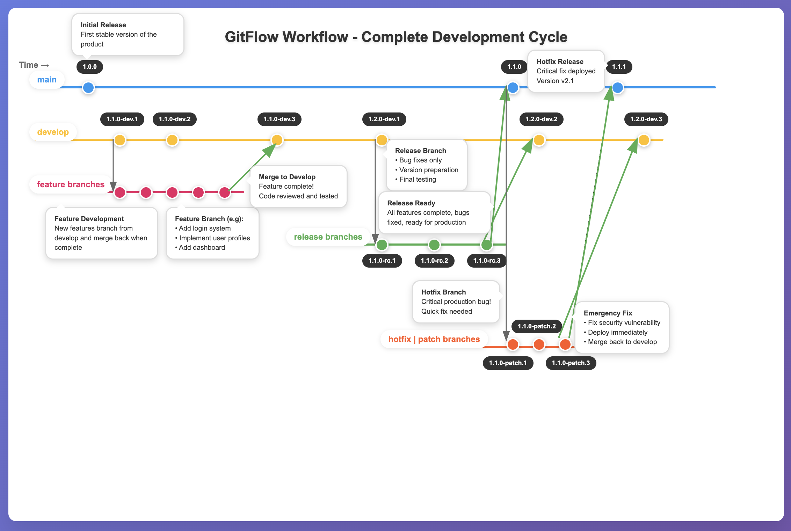

## 📄 README.md

# VersionControlManager

A Python class to manage Git tags following **Semantic Versioning (SemVer)** and **Gitflow branching model**.  
It provides utilities to create, increment, and validate **development**, **release candidate (RC)**, **patch**, and **production** tags.

---
## 📖 Documentation
📚 [Live Documentation](https://0jas.github.io/vcm/)

## 🚀 Features

- Retrieve the latest development, RC, patch, or production tags.
- Increment pre-release tags (`dev`, `rc`, `patch`).
- Initialize new RC or patch tags from existing tags.
- Promote RC/Patch tags into production versions.
- Enforces rules:
  - Prevents RC creation if a production tag exists.
  - Prevents patch creation if no production tag exists.

---

## 🛠️ Installation

```bash
pip install -r requirements.txt
````

---

## 🧪 Tests

```bash
python -m pytest -v
```

---

## 📌 Usage

```python
from src.vcm import *

# Initialize with repo path
manager = VersionControlManager("/path/to/your/repo")

# Get current development tag
print(manager.get_current_tag(prerelease_tag="dev"))

# Increment dev tag
new_dev_tag = manager.increment_prerelease_tag()
print("Created:", new_dev_tag)

# Initialize a new release candidate (RC)
rc_tag = manager.init_new_rc()
print("Created RC:", rc_tag)

# Promote RC to production
prod_tag = manager.create_prod_tag(rc_tag)
print("Created production tag:", prod_tag)
```

---

## 🏷️ Tagging Conventions

* **Development tags** → `X.Y.Z-dev.N`
* **Release Candidate (RC)** → `X.Y.Z-rc.N`
* **Patch tags** → `X.Y.Z-patch.N`
* **Production tags** → `X.Y.Z`

---

## 📊 Gitflow Diagram

The project follows the Gitflow branching model:

* **develop** → main integration branch.
* **feature/** branches → branched from `develop`.
* **release/** → created from `develop`, leads to `main`.
* **patch | hotfix/** → created from `main`.
* **main** → production-ready branch.

Below is the **Git Flow diagram**.
[](assets/html/GitFlow.html)
---

## ✅ Example Workflow

1. Developer creates a **feature branch** from `develop`.
2. Feature branch merges back into `develop`.
3. A **release branch** is created from `develop`.
4. Release is tested, then merged into `main` (production) and `develop`.
5. **Hotfix branches** can be created from `main` and merged back into both `main` and `develop`.

---

